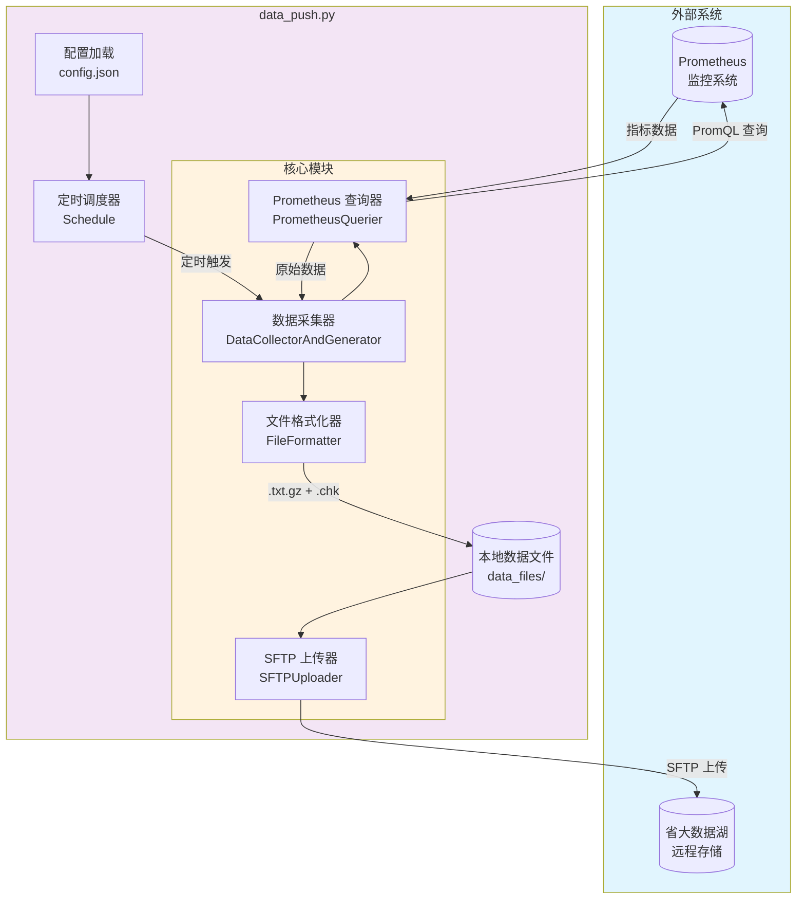
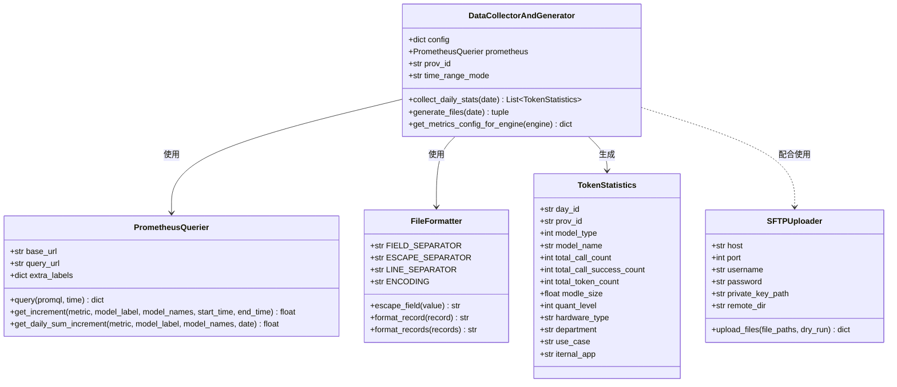
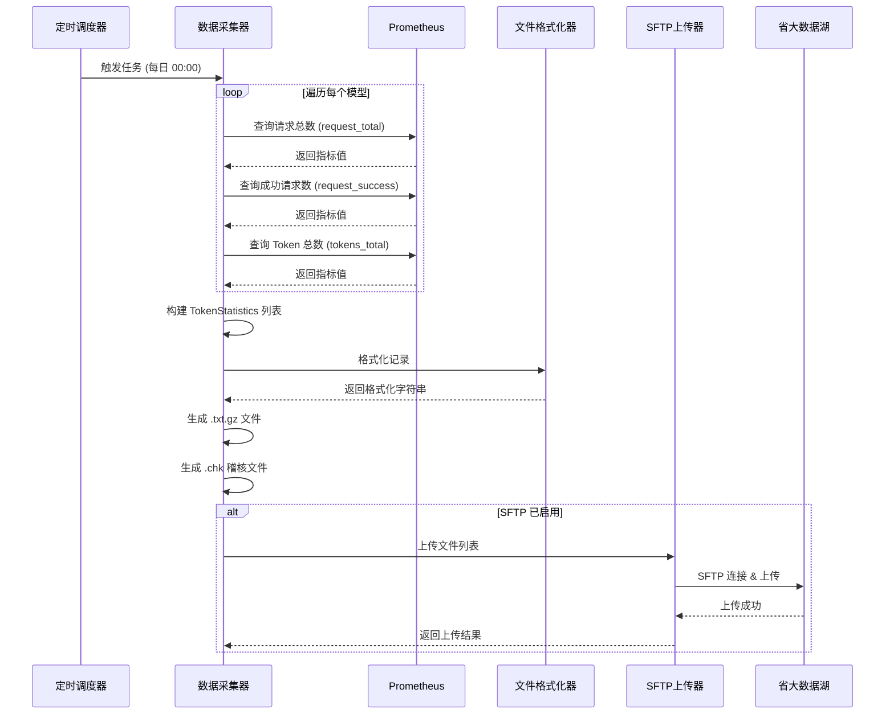

# 数据推送脚本使用说明

## 功能概述

该脚本实现以下功能：
1. **定时采集**：每天凌晨0点自动从 Prometheus 采集前一天的统计数据
2. **文件生成**：生成数据文件（`.txt.gz`）和稽核文件（`.chk`）
3. **SFTP传输**：将生成的文件通过 SFTP 传输到省大数据湖

---

## 系统架构图

### 整体架构流程



### 代码模块结构



### 数据流转图



---

## 文件结构

```
stats/
├── data_push.py        # 主脚本
├── config.json         # 配置文件
├── data_push.log       # 运行日志（自动生成）
└── data_files/         # 生成的数据文件目录
```

## 依赖安装

```bash
pip install requests schedule paramiko
```

## 配置说明

编辑 `config.json` 文件进行配置：

### 基本配置

| 配置项 | 说明 | 可选值 |
|--------|------|--------|
| `schedule_time` | 定时执行时间 | `"00:00"`, `"05:00"` 等 |
| `time_range_mode` | 时间范围模式 | `"fixed_day"`, `"rolling_24h"` |

#### 时间范围模式说明

- **`fixed_day`**（固定日期模式）：采集指定日期的 0:00 到 24:00 的数据
  - 默认采集**前一天**的完整数据
  - 文件名中的时间范围：`20250114000000_20250114235959`

- **`rolling_24h`**（滚动24小时模式）：采集当前时间往前 24 小时的数据
  - 例如：执行时间 15:00，则采集前一天 15:00 到今天 15:00 的数据
  - 文件名中的时间范围：实际的开始和结束时间

### Prometheus 配置

```json
"prometheus": {
    "url": "http://prometheus:9090",
    "extra_label_filters": {}
}
```

### 输出配置

```json
"output": {
    "prov_id": "省份编号",
    "data_type": "token_info",
    "protocol": "0",
    "local_data_dir": "./data_files"
}
```

| 字段 | 说明 |
|------|------|
| `prov_id` | 省份编号，写入数据记录 |
| `data_type` | 数据类型标识，用于文件名生成 |
| `protocol` | 协议标识，用于文件名生成 |
| `local_data_dir` | 本地数据文件存储目录 |

### 推理引擎配置

#### 默认引擎

```json
"default_engine": "vllm"
```

当模型配置中未指定 `engine` 字段时，使用此默认引擎。

#### 引擎指标预设

不同推理引擎使用不同的 Prometheus 指标名称，通过 `metrics_presets` 配置：

```json
"metrics_presets": {
    "vllm": {
        "request_total": "vllm:request_success_total",
        "request_success": "vllm:request_success_total",
        "tokens_total": "vllm:prompt_tokens_total",
        "generation_tokens": "vllm:generation_tokens_total",
        "model_label": "model_name"
    },
    "mindie": {
        "request_total": "request_received_total",
        "request_success": "request_success_total",
        "tokens_total": "prompt_tokens_total",
        "generation_tokens": "generation_tokens_total",
        "model_label": "model_name"
    }
}
```

| 字段 | 说明 |
|------|------|
| `request_total` | 请求总数指标 |
| `request_success` | 成功请求数指标 |
| `tokens_total` | Prompt Token 总数指标 |
| `generation_tokens` | Generation Token 总数指标 |
| `model_label` | 模型名称标签名 |

> **注意**：`total_token_count` = `tokens_total`（Prompt Token）+ `generation_tokens`（Generation Token）

#### 可选指标配置

某些指标可能不存在，通过 `metrics_optional` 控制查询失败时是否报告警告：

```json
"metrics_optional": {
    "request_success": false,
    "generation_tokens": false
}
```

设为 `true` 时，该指标查询失败不会记录警告日志。

### SFTP 配置

```json
"sftp": {
    "enabled": true,
    "host": "192.168.1.100",
    "port": 22,
    "username": "upload_user",
    "password": "your_password",
    "private_key_path": "",
    "remote_dir": "/data/upload/token_info",
    "timeout": 30
}
```

**认证方式**：
- **密码认证**：设置 `password` 字段
- **密钥认证**：设置 `private_key_path` 为私钥文件路径（优先使用）

### 模型配置

每个模型的配置项：

| 字段 | 说明 |
|------|------|
| `name` | 模型名称 |
| `label_match` | Prometheus 标签匹配（字符串或列表） |
| `model_type` | 模型类型 |
| `modle_size` | 模型大小 |
| `quant_level` | 量化级别 |
| `hardware_type` | 硬件类型 |
| `department` | 部门 |
| `use_case` | 使用场景 |
| `engine` | 推理引擎（可选，默认使用 `default_engine`） |
| `iternal_app` | 内部应用标识 |

## 使用方式

### 启动定时任务

```bash
# 启动定时任务（每天0点执行）
python data_push.py

# 模拟运行（不实际传输）
python data_push.py --dry-run

# 使用指定配置文件
python data_push.py --config /path/to/config.json
```

### 单次执行

```bash
# 立即执行一次（采集昨天数据）
python data_push.py --once

# 采集指定日期的数据
python data_push.py --once --date 20250114

# 单次执行 + 模拟运行
python data_push.py --once --dry-run
```

### 命令行参数

| 参数 | 说明 |
|------|------|
| `--config` | 指定配置文件路径 |
| `--once` | 立即执行一次，不启动定时调度 |
| `--date` | 指定采集日期（格式：YYYYMMDD） |
| `--dry-run` | 模拟运行，不实际进行SFTP传输 |

## 输出文件格式

### 数据文件（.txt.gz）

文件名格式：`{data_type}_{protocol}_{start_time}_{end_time}_{gen_time}.txt.gz`

示例：`token_info_0_20250114000000_20250114235959_20250115000100.txt.gz`

### 稽核文件（.chk）

文件名格式：`{data_type}_{protocol}_{start_time}_{end_time}.chk`

内容格式：`{记录数} {数据文件大小} {数据文件名}`

## 后台运行

### Linux

```bash
# 使用 nohup
nohup python data_push.py > /dev/null 2>&1 &

# 使用 systemd（推荐）
# 创建 /etc/systemd/system/data-push.service
```

### Windows

使用计划任务或将脚本配置为 Windows 服务。

## 日志

运行日志保存在 `data_push.log` 文件中，同时也会输出到控制台。
